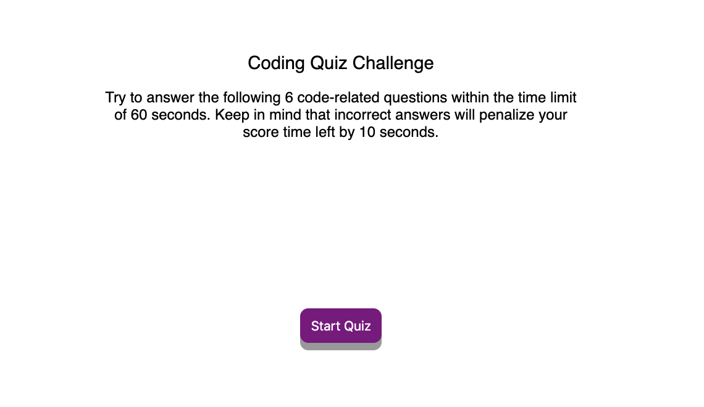

# Code Quiz

Created a timed quiz on coding fundamentals that stores high scores. The app will run in the browser and feature dynamically updated HTML and CSS powered by your JavaScript code. It features a clean and polished user interface and is responsive, ensuring that it adapts to multiple screen sizes.

### Installing

Download Html, CSS and JS files.

## Built With

* HTML
* CSS
* Javascript

 
## Speical Features

Curently cooded for 6 quiz questions and a time of 60 seconds to answer. Question data can be added with the app automatically adding time to the timer.
Example: a 20 question quiz will add 200 seconds to answer. 

Highscores will be save so users can attempt to better thier scores while learing codeing questions that can be used as practice for technical interviews. 

For testing, the answers to quiz are: 
1. selector
2. cost
3. head
4. ondrop
5. All the above
6. Node

## Acknowledgments

* Rutgers Bootcamp Team

